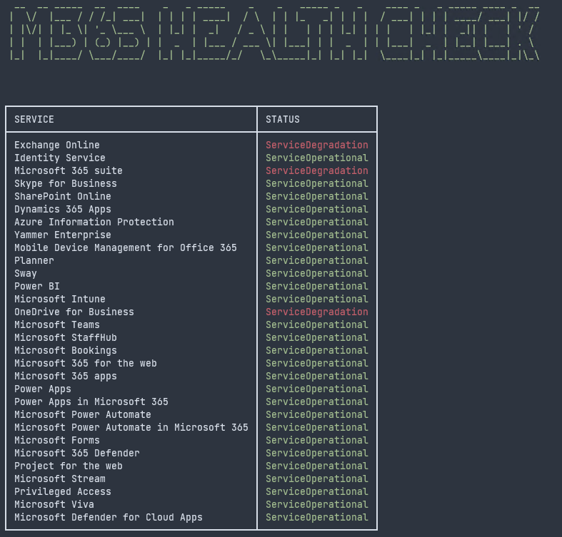

# M365 Health Check

Simple console application that provides the health report of all subscribed services for a tenant, using Microsoft Graph [ServiceHealth](https://learn.microsoft.com/en-us/graph/api/serviceannouncement-list-healthoverviews?view=graph-rest-1.0&tabs=http) APIs

